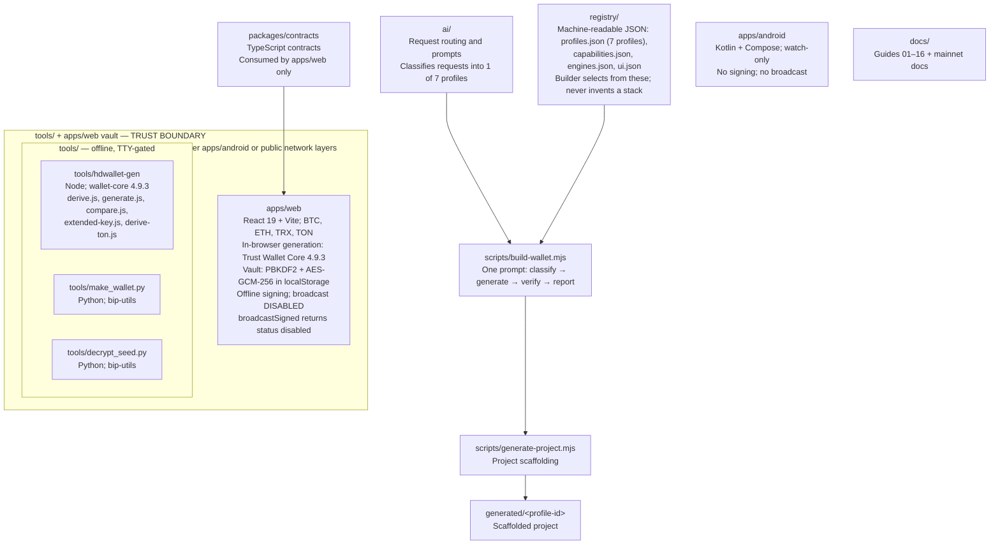

```mermaid
flowchart TB
    accTitle: Bawa wallet-builder repository architecture
    accDescr: ai/ classifies requests into seven profiles. scripts/build-wallet.mjs selects only registry-defined stacks, then generates, verifies and reports. scripts/generate-project.mjs scaffolds generated/<profile-id>. apps/web alone consumes packages/contracts. Secrets never cross from offline generation or the web vault into watch-only or public network layers. Web broadcast is disabled; Android has neither signing nor broadcast.

    ai["ai/<br/>Request routing and prompts<br/>Classifies requests into 1 of 7 profiles"]
    registry["registry/<br/>Machine-readable JSON: profiles.json (7 profiles),<br/>capabilities.json, engines.json, ui.json<br/>Builder selects from these; never invents a stack"]
    build["scripts/build-wallet.mjs<br/>One prompt: classify → generate → verify → report"]
    generate["scripts/generate-project.mjs<br/>Project scaffolding"]
    output["generated/&lt;profile-id&gt;<br/>Scaffolded project"]
    contracts["packages/contracts<br/>TypeScript contracts<br/>Consumed by apps/web only"]
    android["apps/android<br/>Kotlin + Compose; watch-only<br/>No signing; no broadcast"]
    docs["docs/<br/>Guides 01–16 + mainnet docs"]

    subgraph secretBoundary["tools/ + apps/web vault — TRUST BOUNDARY<br/>Mnemonic, seed and private keys never enter apps/android or public network layers"]
        web["apps/web<br/>React 19 + Vite; BTC, ETH, TRX, TON<br/>In-browser generation: Trust Wallet Core 4.9.3<br/>Vault: PBKDF2 + AES-GCM-256 in localStorage<br/>Offline signing; broadcast DISABLED<br/>broadcastSigned returns status disabled"]

        subgraph offlineTools["tools/ — offline, TTY-gated"]
            hd["tools/hdwallet-gen<br/>Node; wallet-core 4.9.3<br/>derive.js, generate.js, compare.js,<br/>extended-key.js, derive-ton.js"]
            make["tools/make_wallet.py<br/>Python; bip-utils"]
            decrypt["tools/decrypt_seed.py<br/>Python; bip-utils"]
        end
    end

    ai --> build
    registry --> build
    build --> generate
    generate --> output
    contracts --> web
```

No public-network path was supplied, so no public-network node is drawn.