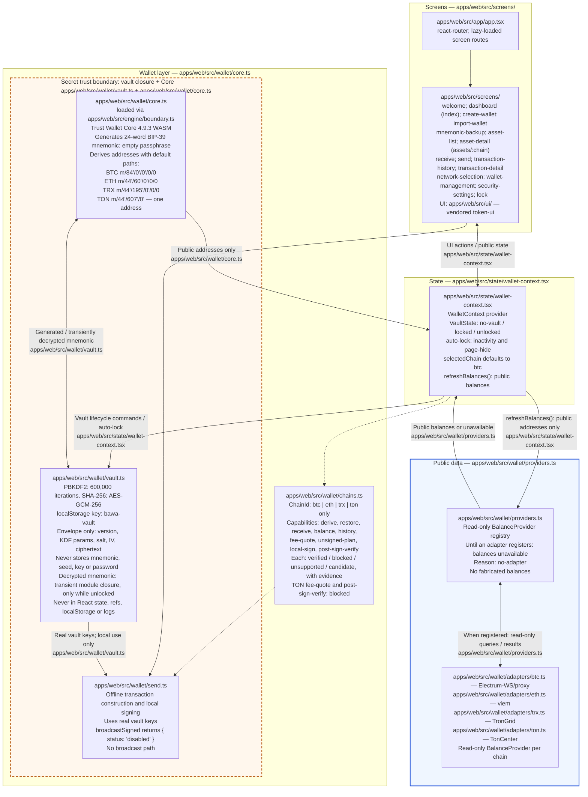

```mermaid
flowchart TB
  accTitle: Bawa web wallet components and data flow (apps/web/src/app/app.tsx)
  accDescr: Screens and WalletContext coordinate the wallet lifecycle. The dashed secret boundary encloses the transient mnemonic closure in apps/web/src/wallet/vault.ts, Core operations, and local send signing. Public addresses and balance results flow through read-only apps/web/src/wallet/providers.ts and adapters. Missing adapters report no-adapter; broadcasting is disabled.

  subgraph SCREENS["Screens — apps/web/src/screens/"]
    direction TB
    APP["apps/web/src/app/app.tsx<br/>react-router; lazy-loaded screen routes"]
    VIEWS["apps/web/src/screens/<br/>welcome; dashboard (index); create-wallet; import-wallet<br/>mnemonic-backup; asset-list; asset-detail (assets/:chain)<br/>receive; send; transaction-history; transaction-detail<br/>network-selection; wallet-management; security-settings; lock<br/>UI: apps/web/src/ui/ — vendored token-ui"]
    APP --> VIEWS
  end

  subgraph STATE["State — apps/web/src/state/wallet-context.tsx"]
    CTX["apps/web/src/state/wallet-context.tsx<br/>WalletContext provider<br/>VaultState: no-vault / locked / unlocked<br/>auto-lock: inactivity and page-hide<br/>selectedChain defaults to btc<br/>refreshBalances(): public balances"]
  end

  subgraph WALLET["Wallet layer — apps/web/src/wallet/core.ts"]
    direction TB
    CHAINS["apps/web/src/wallet/chains.ts<br/>ChainId: btc | eth | trx | ton only<br/>Capabilities: derive, restore, receive, balance, history,<br/>fee-quote, unsigned-plan, local-sign, post-sign-verify<br/>Each: verified / blocked / unsupported / candidate, with evidence<br/>TON fee-quote and post-sign-verify: blocked"]

    subgraph SECRET["Secret trust boundary: vault closure + Core<br/>apps/web/src/wallet/vault.ts + apps/web/src/wallet/core.ts"]
      direction TB
      VAULT["apps/web/src/wallet/vault.ts<br/>PBKDF2: 600,000 iterations, SHA-256; AES-GCM-256<br/>localStorage key: bawa-vault<br/>Envelope only: version, KDF params, salt, IV, ciphertext<br/>Never stores mnemonic, seed, key or password<br/>Decrypted mnemonic: transient module closure, only while unlocked<br/>Never in React state, refs, localStorage or logs"]
      CORE["apps/web/src/wallet/core.ts<br/>loaded via apps/web/src/engine/boundary.ts<br/>Trust Wallet Core 4.9.3 WASM<br/>Generates 24-word BIP-39 mnemonic; empty passphrase<br/>Derives addresses with default paths:<br/>BTC m/84'/0'/0'/0/0<br/>ETH m/44'/60'/0'/0/0<br/>TRX m/44'/195'/0'/0/0<br/>TON m/44'/607'/0' — one address"]
      SEND["apps/web/src/wallet/send.ts<br/>Offline transaction construction and local signing<br/>Uses real vault keys<br/>broadcastSigned returns { status: 'disabled' }<br/>No broadcast path"]
    end
  end

  subgraph PUBLIC["Public data — apps/web/src/wallet/providers.ts"]
    direction TB
    PROVIDERS["apps/web/src/wallet/providers.ts<br/>Read-only BalanceProvider registry<br/>Until an adapter registers: balances unavailable<br/>Reason: no-adapter<br/>No fabricated balances"]
    ADAPTERS["apps/web/src/wallet/adapters/btc.ts — Electrum-WS/proxy<br/>apps/web/src/wallet/adapters/eth.ts — viem<br/>apps/web/src/wallet/adapters/trx.ts — TronGrid<br/>apps/web/src/wallet/adapters/ton.ts — TonCenter<br/>Read-only BalanceProvider per chain"]
  end

  VIEWS <-->|"UI actions / public state<br/>apps/web/src/state/wallet-context.tsx"| CTX
  CTX -->|"Vault lifecycle commands / auto-lock<br/>apps/web/src/state/wallet-context.tsx"| VAULT
  CTX -.-> CHAINS
  CHAINS -.-> SEND
  VIEWS --> SEND

  CORE <-->|"Generated / transiently decrypted mnemonic<br/>apps/web/src/wallet/vault.ts"| VAULT
  CORE -->|"Public addresses only<br/>apps/web/src/wallet/core.ts"| CTX
  VAULT -->|"Real vault keys; local use only<br/>apps/web/src/wallet/vault.ts"| SEND

  CTX -->|"refreshBalances(): public addresses only<br/>apps/web/src/state/wallet-context.tsx"| PROVIDERS
  PROVIDERS -->|"Public balances or unavailable<br/>apps/web/src/wallet/providers.ts"| CTX
  PROVIDERS <-->|"When registered: read-only queries / results<br/>apps/web/src/wallet/providers.ts"| ADAPTERS

  style SECRET fill:#fff7ed,stroke:#b45309,stroke-width:2px,stroke-dasharray:6 4
  style PUBLIC fill:#eff6ff,stroke:#1d4ed8,stroke-width:2px
```