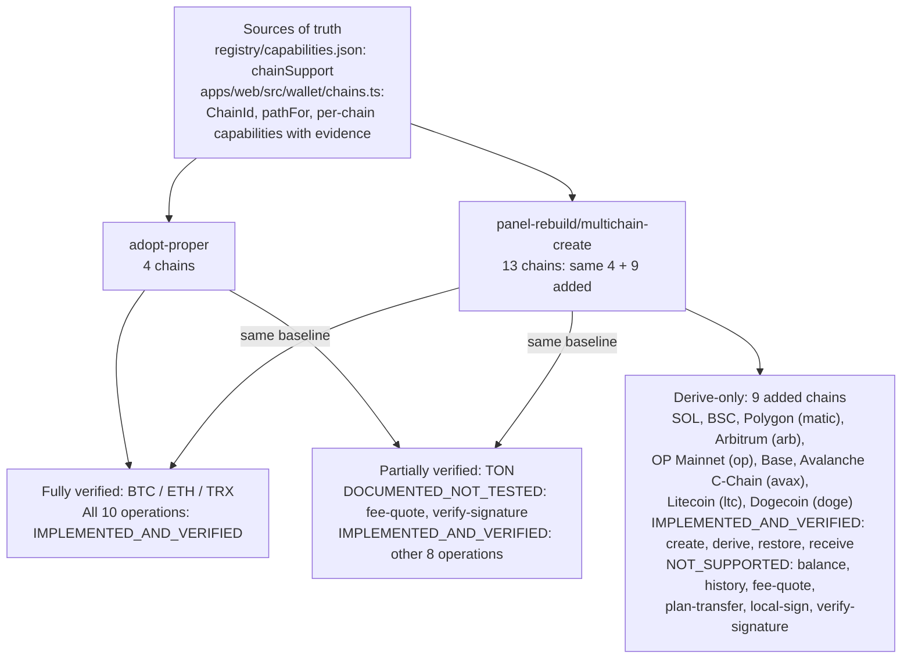

```mermaid
flowchart TB
    accTitle: Bawa chain support overview
    accDescr: adopt-proper supports BTC, ETH and TRX with all ten operations verified, plus TON with fee-quote and verify-signature documented but untested. panel-rebuild/multichain-create includes the same four chains plus nine derive-only additions, with create, derive, restore and receive verified and the remaining six operations unsupported.

    S["Sources of truth<br/>registry/capabilities.json: chainSupport<br/>apps/web/src/wallet/chains.ts:<br/>ChainId, pathFor, per-chain capabilities with evidence"]

    A["adopt-proper<br/>4 chains"]
    M["panel-rebuild/multichain-create<br/>13 chains: same 4 + 9 added"]

    F["Fully verified: BTC / ETH / TRX<br/>All 10 operations: IMPLEMENTED_AND_VERIFIED"]

    T["Partially verified: TON<br/>DOCUMENTED_NOT_TESTED: fee-quote, verify-signature<br/>IMPLEMENTED_AND_VERIFIED: other 8 operations"]

    D["Derive-only: 9 added chains<br/>SOL, BSC, Polygon (matic), Arbitrum (arb),<br/>OP Mainnet (op), Base, Avalanche C-Chain (avax),<br/>Litecoin (ltc), Dogecoin (doge)<br/>IMPLEMENTED_AND_VERIFIED: create, derive, restore, receive<br/>NOT_SUPPORTED: balance, history, fee-quote,<br/>plan-transfer, local-sign, verify-signature"]

    S --> A
    S --> M
    A --> F
    A --> T
    M -->|"same baseline"| F
    M -->|"same baseline"| T
    M --> D
```

Derivation paths stay in the per-chain table. No broadcast exists anywhere in the repo.