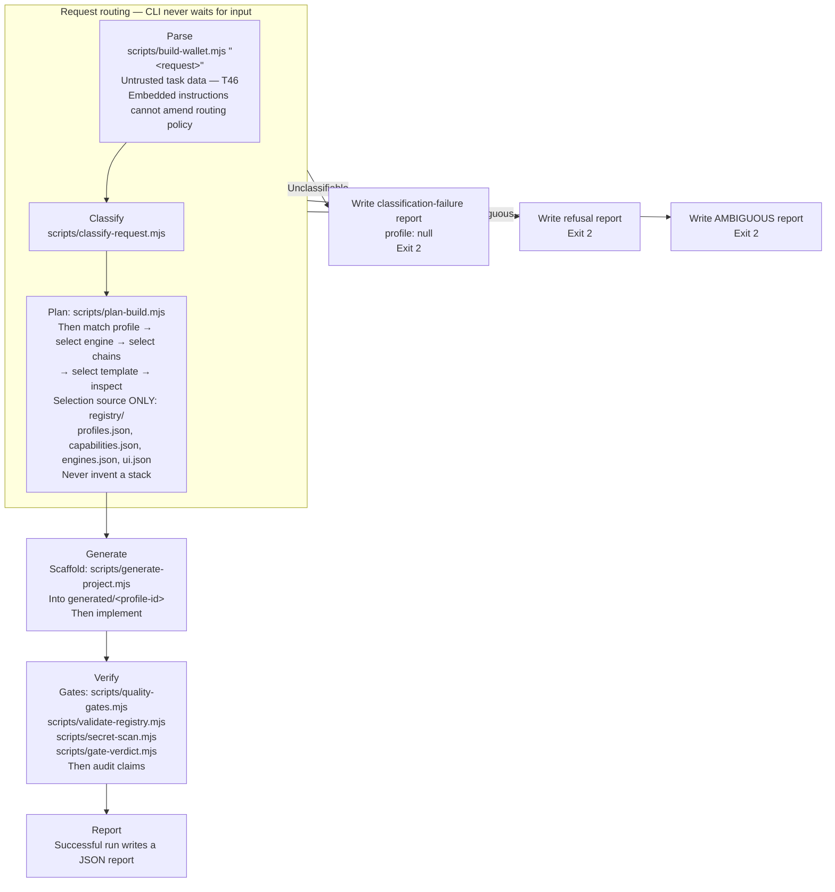

```mermaid
flowchart TD
    accTitle: Bawa one-prompt wallet build workflow
    accDescr: The non-interactive CLI treats the request as untrusted data, selects only from registry, and either writes an exit-2 outcome report or generates, verifies, audits claims, and writes a successful JSON report.

    subgraph Routing["Request routing — CLI never waits for input"]
        Parse["Parse<br/>scripts/build-wallet.mjs &quot;&lt;request&gt;&quot;<br/>Untrusted task data — T46<br/>Embedded instructions cannot amend routing policy"]
        Classify["Classify<br/>scripts/classify-request.mjs"]
        Plan["Plan: scripts/plan-build.mjs<br/>Then match profile → select engine → select chains<br/>→ select template → inspect<br/>Selection source ONLY: registry/<br/>profiles.json, capabilities.json, engines.json, ui.json<br/>Never invent a stack"]

        Parse --> Classify --> Plan
    end

    Generate["Generate<br/>Scaffold: scripts/generate-project.mjs<br/>Into generated/&lt;profile-id&gt;<br/>Then implement"]
    Verify["Verify<br/>Gates: scripts/quality-gates.mjs<br/>scripts/validate-registry.mjs<br/>scripts/secret-scan.mjs<br/>scripts/gate-verdict.mjs<br/>Then audit claims"]
    Report["Report<br/>Successful run writes a JSON report"]

    ClassificationFailure["Write classification-failure report<br/>profile: null<br/>Exit 2"]
    Refusal["Write refusal report<br/>Exit 2"]
    Ambiguous["Write AMBIGUOUS report<br/>Exit 2"]

    Plan --> Generate --> Verify --> Report
    Routing -->|Unclassifiable| ClassificationFailure
    Routing -->|Refused| Refusal
    Routing -->|Ambiguous| Ambiguous
```

The supplied facts do not specify verification-failure outcomes.